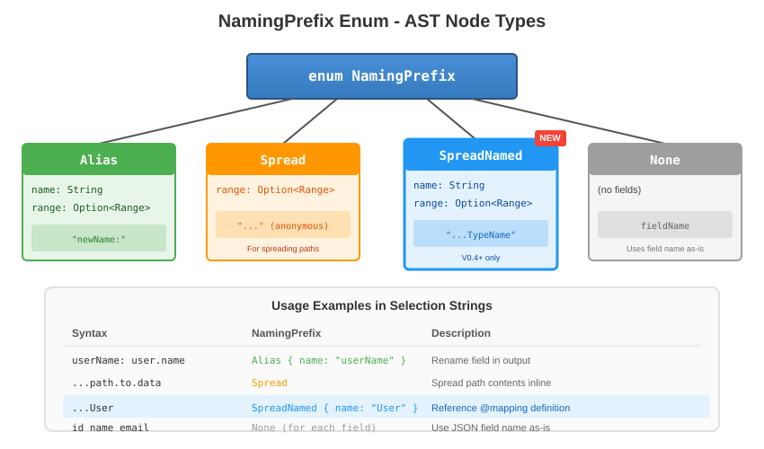
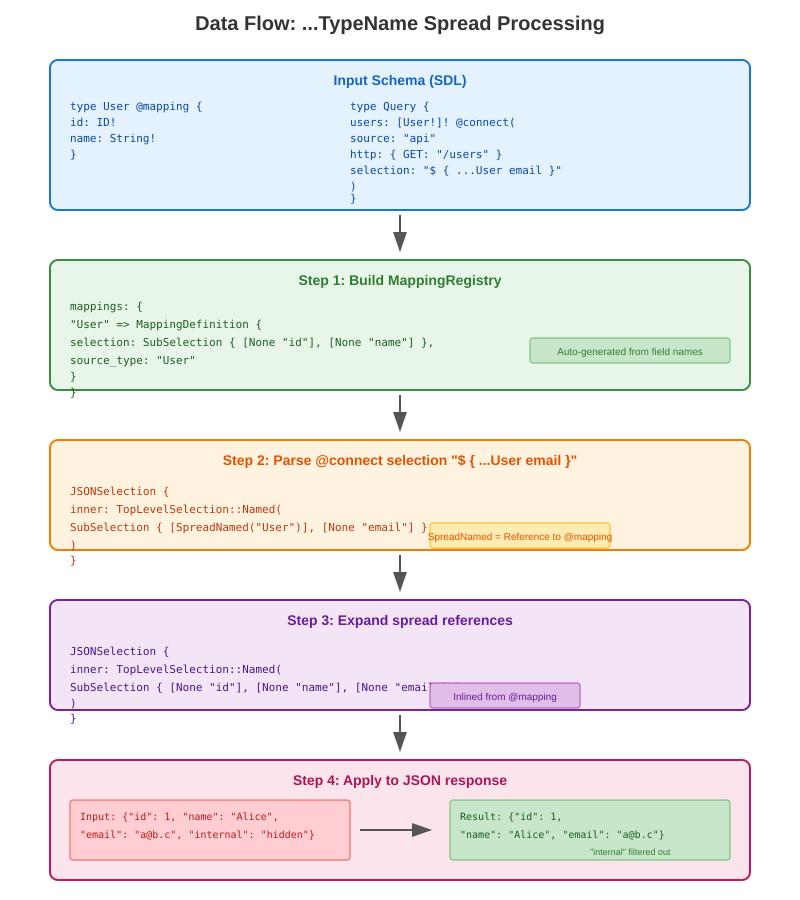
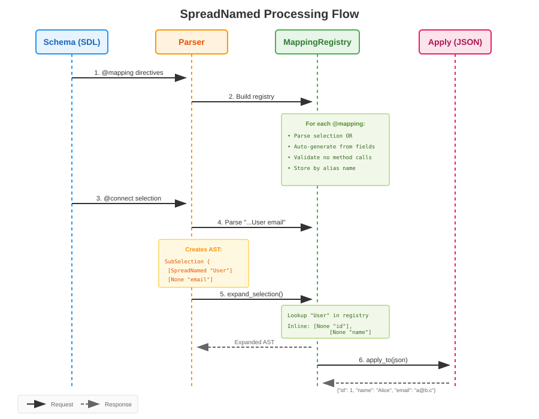
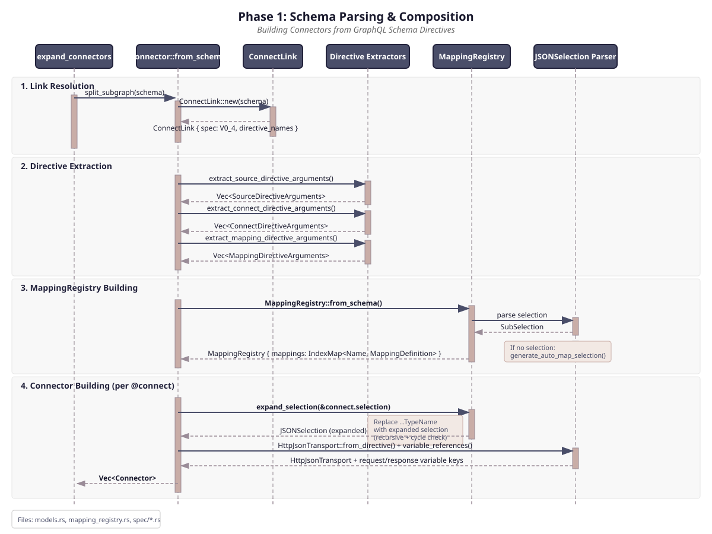
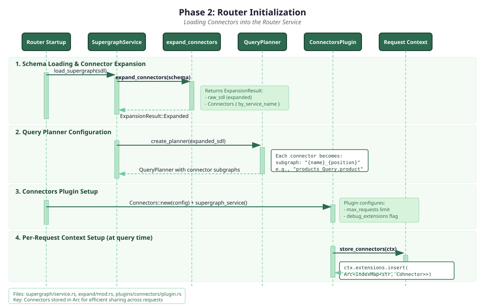
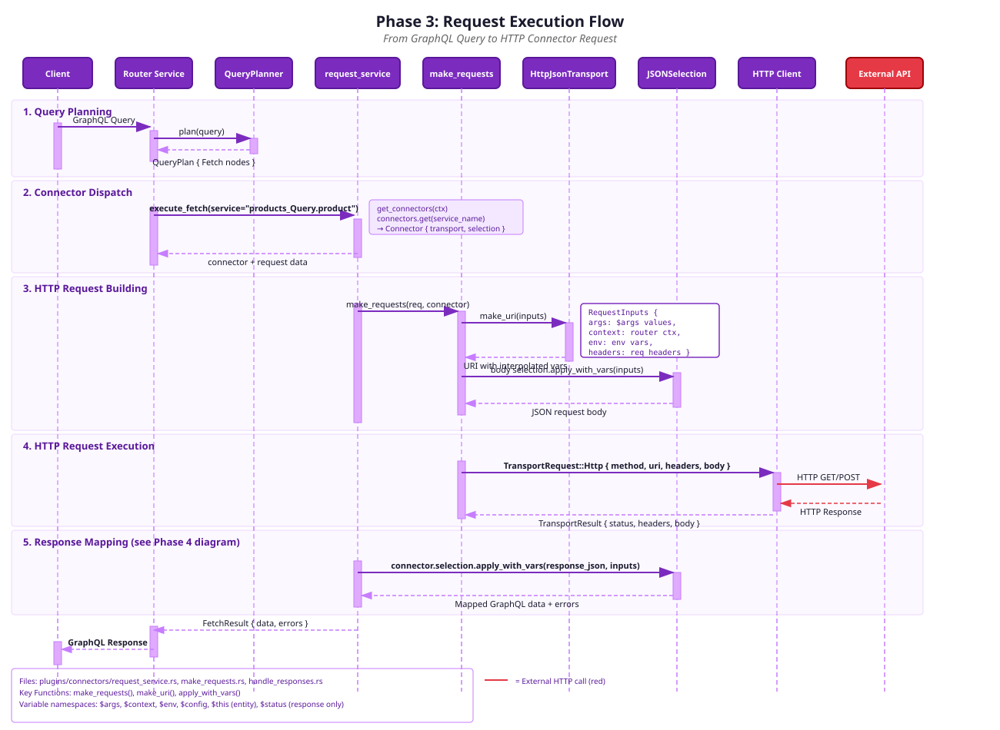
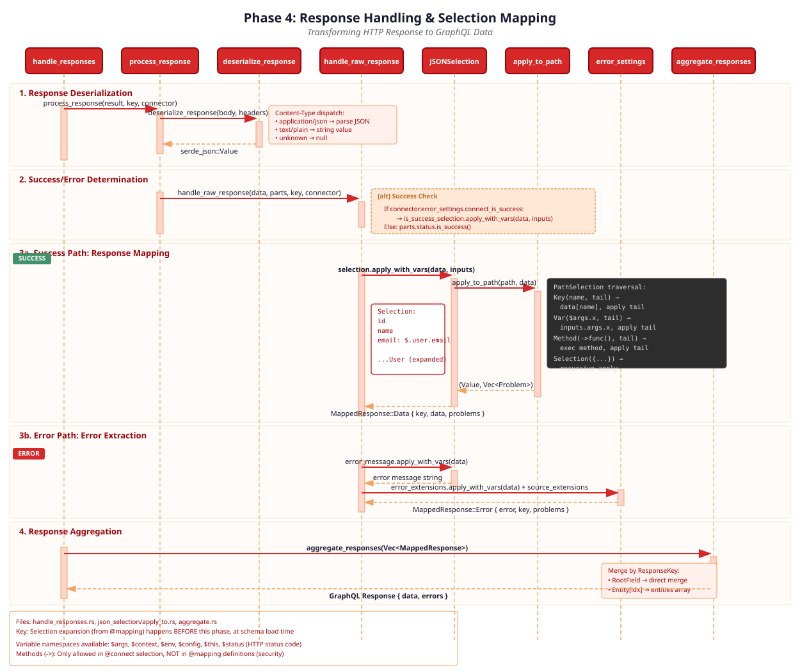

# @mapping Directive

This document describes the `@mapping` directive for Apollo Connectors - enabling reusable JSON-to-GraphQL field mappings.

## Overview

The `@mapping` directive allows defining field mappings once on a type and referencing them via `...TypeName` spread syntax in `@connect` selection strings.

## Spec version

`@mapping` requires Connect spec **v0.5 or later**. A schema that declares `@mapping`
against v0.4 or earlier is rejected — the directive is neither injected into the schema
nor processed. The resolved spec is threaded from the `ConnectLink` into
`extract_mapping_directive_arguments`, so there is a single source of truth (no
fail-open re-resolution).

## Syntax

```graphql
directive @mapping(selection: String, as: String) repeatable on OBJECT | INTERFACE
```

**Arguments:**
- `selection` (optional): A JSONSelection string defining the field mapping
- `as` (optional): An alias for the mapping, allowing multiple mappings per type

## Usage

### Auto-map Mode

When no `selection` is provided, mapping is generated from field names:

```graphql
type User @mapping {
  id: ID!
  name: String!
  email: String!
}
# Equivalent to: @mapping("id name email")
```

### Explicit Selection

```graphql
type Post @mapping("""
  id
  title
  authorName: author.name
  createdAt: metadata.created_at
""") {
  id: ID!
  title: String!
  authorName: String!
  createdAt: String!
}
```

### Multiple Mappings with Aliases

```graphql
type User @mapping(as: "UserBasic", "id name")
         @mapping(as: "UserFull", "id name email profile { avatar }") {
  id: ID!
  name: String!
  email: String!
  profile: Profile
}

# Reference: "...UserBasic" or "...UserFull"
```

### Referencing in @connect

```graphql
type Query {
  user(id: ID!): User @connect(
    source: "api"
    http: { GET: "/users/{$args.id}" }
    selection: "...User"
  )

  users: [User!]! @connect(
    source: "api"
    http: { GET: "/users" }
    selection: "items { ...User }"
  )
}
```

### Where `...Type` spreads are permitted

Spreads are expanded in exactly two `@connect` arguments:

| Argument | Spreads | Behavior |
|----------|---------|----------|
| `selection` (response) | expanded | Replaced with the mapping's fields before type-checking and at runtime. |
| `http.body` (request) | expanded | Expanded on **both** the validation path (`Connect::expand_http_body`) and the runtime path (`HttpJsonTransport::from_directive`). |

Every other selection-bearing argument **rejects** spreads at parse time, with
`spreads (\`...Type\`) are not supported in this argument`:

- `http.path`, `http.queryParams` (and the `@source` equivalents)
- `errors.message`, `errors.extensions`
- `isSuccess`

Without this, a spread would parse, escape validation, and hit the unexpanded-spread
guard at runtime (request failure / dropped data). All six selection arguments flow
through one parse choke point (`parse_mapping_argument(allow_spreads)`), so the
allow/reject decision lives in one place. Request-side spreads beyond `body` are
intentionally undesigned for now and can be promoted to expansion later if needed.

## Parameterized Mappings

Mappings can declare parameters — any `$variable` in the selection that is not a reserved runtime namespace (`$this`, `$args`, `$config`, `$status`, `$context`, `$request`, `$response`, `$env`, `$batch`).

```graphql
type User @mapping(selection: "id friends->slice(0, $count)") {
  id: ID!
  friends: [User!]!
}

type Query {
  recentFriends: User @connect(selection: "...User(count: 3)")
  allFriends: User @connect(selection: "...User(count: 50)")
}
```

### Rules

- Parameters are **inferred** from the selection AST (no explicit declaration needed).
- All parameters are **required** at every spread site.
- Substitution is **schema-load-time** (structural AST replacement).
- v1 constraint: arguments must be **literals only** (string, number, boolean, null).
- Nested forwarding rejected: `...Inner(count: $count)` inside a mapping is an error.
- Argument names must not conflict with reserved runtime namespaces.

### Key types

| Type | File | Purpose |
|------|------|---------|
| `SpreadArg` | `json_selection/parser.rs` | Single `name: value` argument |
| `SpreadArgs` | `json_selection/parser.rs` | Parsed argument list with range |
| `MappingDefinition.parameters` | `mapping_registry.rs` | Inferred parameter set |

### Substitution flow

1. `compute_parameters()` walks the selection's `external_var_paths()`, filters out `Namespace` matches.
2. At expansion time, `build_substitutions()` validates args against parameters.
3. `expand_path_list` (Var arm) and `expand_lit_expr` (Path arm) perform the replacement.

## Method Calls

Methods (`->`) ARE allowed in `@mapping` selections:

```graphql
type User @mapping("""
  id
  name: fullName->lowercase
  tags: categories->first
""") { ... }
```

**Note:** `...Type->method()` is invalid syntax (parser rejects it).

## Architecture

### Key Components

| Component | File | Purpose |
|-----------|------|---------|
| `MappingDirectiveArguments` | `spec/mapping.rs` | Parsed directive arguments |
| `MappingRegistry` | `mapping_registry.rs` | Stores and expands mappings |
| `SpreadNamed` | `json_selection/parser.rs` | Parser variant for `...TypeName(args)` |

### Data Flow

1. **Schema Loading**: Parse SDL, extract `@mapping` directives
2. **Registry Building**: `MappingRegistry::from_schema()` collects all mappings
3. **Connector Processing**: `expand_selection()` replaces spreads with definitions

### Expansion Algorithm

```rust
fn expand_sub_selection(&self, sub: &SubSelection, expanding: &mut HashSet<String>) {
    for named in &sub.selections {
        match &named.prefix {
            NamingPrefix::SpreadNamed { name, .. } => {
                // 1. Check for circular reference
                // 2. Look up the mapping
                // 3. Mark as expanding (cycle detection)
                // 4. Recursively expand
                // 5. Inline expanded selections
            }
            _ => { /* Recursively expand nested selections */ }
        }
    }
}
```

### Bounds and recursion

Expansion is bounded two ways to keep a pathological schema (reachable from an
untrusted subgraph at compose time) from hanging or OOMing:

- `MAX_EXPANSION_DEPTH` (32): maximum spread **nesting** depth.
- `MAX_EXPANSION_NODES` (10_000): maximum total `expand_*` calls, bounding **fan-out**
  regardless of shape — a `...L1 ...L1` "billion laughs" schema that doubles at each
  level cannot blow up exponentially. Depth alone does not catch this, since sibling
  spreads re-expand independently.

Circular mapping references are currently a hard error (`Circular reference detected`).
Note: connectors are expected to gain **cyclic-reference support** in a future revision;
when that lands, cycle rejection will be relaxed and `MAX_EXPANSION_NODES` becomes the
bound on how far a cycle unfolds.

## Testing

```bash
# Run all mapping tests
cargo test -p apollo-federation mapping

# Run specific test
cargo test -p apollo-federation test_expand_simple_spread
```

## Error Messages

| Error | Cause |
|-------|-------|
| `Unknown mapping reference: ...FooType` | No `@mapping` on type `FooType` |
| `Circular reference detected` | Mapping references itself |
| `Failed to parse @mapping selection` | Invalid selection syntax |
| `must be a field selection, not a path` | Selection starts with `$` |
| `passes arguments, but mapping has no parameters` | Args on parameterless mapping |
| `is missing required argument` | Spread omits a parameter |
| `passes unknown argument` | Arg name not in mapping's parameters |
| `provides duplicate argument` | Same arg name passed twice |
| `uses a variable/path as argument value` | Non-literal arg (v1 restriction) |
| `conflicts with reserved runtime variable` | Arg name matches a Namespace |
| `must start with an uppercase ASCII letter` | `as:` value not SpreadNamed-compatible |
| `Mapping expansion exceeded the maximum of N nodes` | Total expansion exceeds `MAX_EXPANSION_NODES` (fan-out / billion-laughs guard) |
| `spreads (\`...Type\`) are not supported in this argument` | Spread used outside `selection` / `body` (e.g. `path`, `errors.message`) |
| `requires connect spec v0.5 or later` | `@mapping` declared against Connect v0.4 or earlier |

## Diagrams

### NamingPrefix AST Structure

The `NamingPrefix` enum defines the four AST node types for selection prefixes. `SpreadNamed` is the variant added for `@mapping` references.



### SpreadNamed Data Flow

End-to-end data flow showing how `...TypeName` is parsed, expanded via the registry, and applied to JSON at runtime.



### SpreadNamed Processing Sequence

Sequence diagram showing the interaction between Schema, Parser, MappingRegistry, and JSON application.



### Schema Parsing and Composition

How the router parses subgraph schemas, extracts `@mapping` directives, builds the MappingRegistry, and expands `...TypeName` spreads in `@connect` selections.



### Router Initialization

Loading connectors into the Router service, including supergraph expansion and plugin setup.



### Request Execution

From GraphQL query through query planning, connector dispatch, HTTP request building, to external API call.



### Response Handling

Transforming HTTP responses back to GraphQL data via JSONSelection mapping (applied after expansion).



---

## Implementation History

### Commit 1: Core Implementation

**Files changed:**
| File | Change |
|------|--------|
| `spec/mod.rs` | Added `ConnectSpec::V0_5` (or V0_4) |
| `spec/type_and_directive_specifications.rs` | `mapping_directive_spec()` |
| `spec/mapping.rs` | **NEW** - `MappingDirectiveArguments` |
| `mapping_registry.rs` | **NEW** - `MappingRegistry` |
| `json_selection/parser.rs` | `NamingPrefix::SpreadNamed` |
| `json_selection/apply_to.rs` | Handle `SpreadNamed` |
| `json_selection/location.rs` | Handle `SpreadNamed` |
| `json_selection/pretty.rs` | Handle `SpreadNamed` |
| `json_selection/mod.rs` | `PathSelection::empty()` |
| `models.rs` | `mapping_directive_name` |

### Commit 2: Supergraph Expansion Fix

**Problem:** Router failed with `@mapping does not refer to an existing directive`.

**Solution:** Added `mapping_directive_name` to `directive_deny_list` in `expand/mod.rs`.

| File | Change |
|------|--------|
| `expand/mod.rs` | Added to `directive_deny_list` |
| `supergraph/mod.rs` | Added `test_join_directives_v0_5_mapping` |

### Hardening: DoS bounds, body expansion, spec-gate cleanup

Driven by a recall-biased review. Five fixes:

1. **Expansion node cap** (`MAX_EXPANSION_NODES`) threaded through the `expand_*`
   family — bounds total fan-out, killing "billion laughs"-style spread expansion.
2. **Parser depth** (`SpanExtra::recursion_depth`) — bounds cumulative path+brace
   nesting so a crafted `a.a…{ a.a…{ … } }` can't overflow the stack at compose time.
3. **Request `body` expansion + spread rejection** — `...Type` now expands in
   `http.body` (validation + runtime); rejected everywhere else via
   `parse_mapping_argument(allow_spreads)`.
4. **Spec-gate cleanup** — the resolved spec is threaded from `from_schema` into
   `extract_mapping_directive_arguments`; removed the dead `unwrap_or` fallback and
   the duplicate `DEFAULT_CONNECT_SPEC` constant.
5. **Deterministic error ordering** — the "Available parameters" list is sorted.
